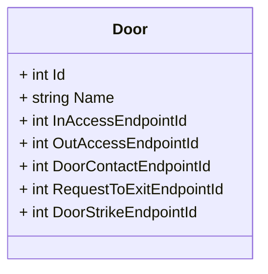
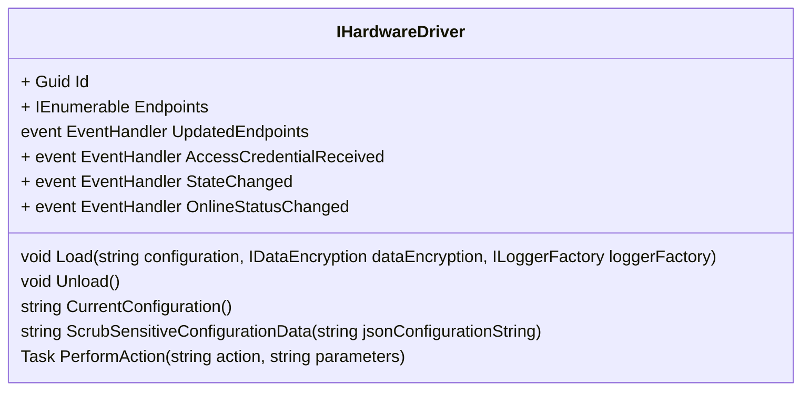
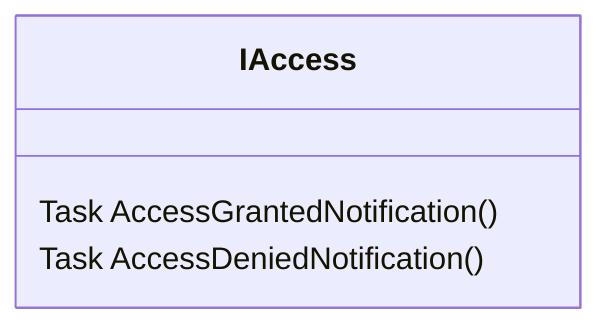
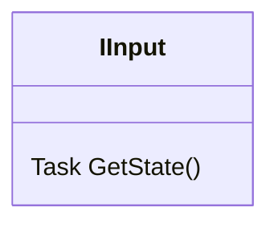
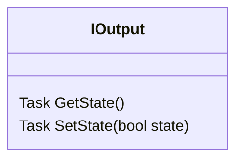
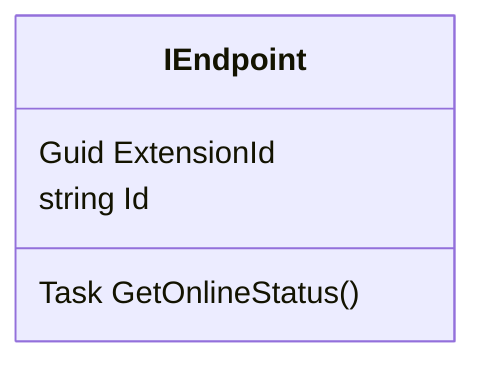

# Aporta Core Abstractions and Concepts

## Door
A physical door (A "**Porta**"). Access into and out of buildings through doors is controlled by **[Devices](#device)**.

In Aporta, Doors are modeled by a Door class.

**Namespace**: Aporta.Shared.Models

## Device
The physical hardware device controlling access through a [door](#door). A device typically consists of a card or badge **[Reader](#reader)**, an [Output](#output) mechanism for physically locking and unlocking the door, and an [Input](#input) mechanism for determining if the door is actually closed and locked.

## Virtual Device
Aporta comes with a built in mock (or "Virtual") device so that you can explore the features of Aporta and learn how it works without needing a physical hardware device. 

## Driver
The software in Aporta that controls a [device](#device). The driver is responsible for orchestrating communication with a device's [readers](#reader), [inputs](#input) and [outputs](#output). Reading the security credentials from a [reader](#reader) when a card or badge is swiped, authorizing access through a door, Issuing a command to the device [Output](#output) to unlock the door upon successful authorization, and querying device [Input](#input) to ensure the door is actually unlocked are all responsibilities of the driver.

**Namespace**: Aporta.Drivers

Drivers are located in the Aporta.Drivers namespace.

Aporta is extensible. You can [write your own drivers](HowToCreateADriver.md) for your own devices.

All drivers in Aporta are a kind of IHardwareDriver and implement the **IHardwareDriver** interface.

IHardwareDriver is a part of the **Aporta.Extensions.Hardware** namespace.

## Reader
The part of the device that reads the credentials from a card or badge. A reader is assigned to a [door](#door) as either allowing Access into a building or Access out of a building.

Readers are a kind of Access through a door and implement the **IAccess** interface.

**Namespace**: Aporta.Extensions.Endpoint

Door Access is a kind of device [EndPoint](#endpoint).

## Input

The part of a device that reports whether a physical door is actually locked or unlocked, opened or closed.

Inputs are a kind of device [EndPoint](#endpoint).

## Output

The part of the device that physically locks and unlocks a door.

**Namespace**: Aporta.Extensions.Endpoint

Outputs are a kind of device [EndPoint](#endpoint).

## EndPoint

An EndPoint is the highest level of abstraction of the "kinds of things" that interact with and comprise a [device](#device).
[Readers](#reader) are a kind of EndPoint. So is the physical [Output]() mechanism used for actually locking the door (Typically a relay), as is the physical [Input](#input) mechanism used for determining if a door is closed.

**Namespace**: Aporta.Extensions.Endpoint

