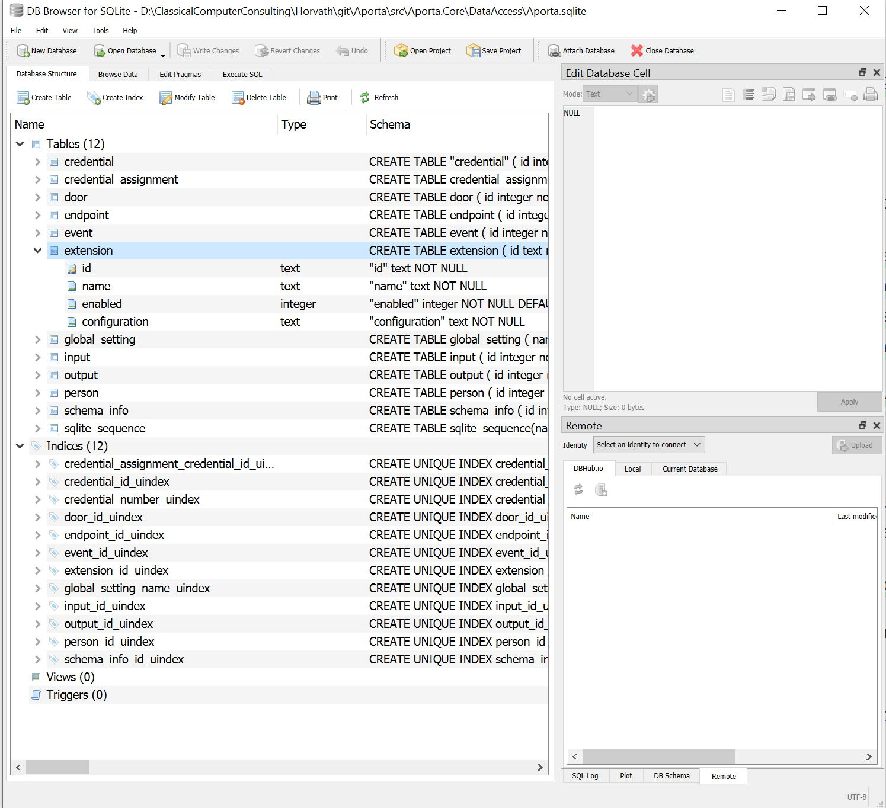
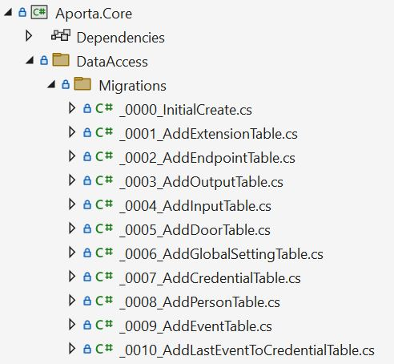
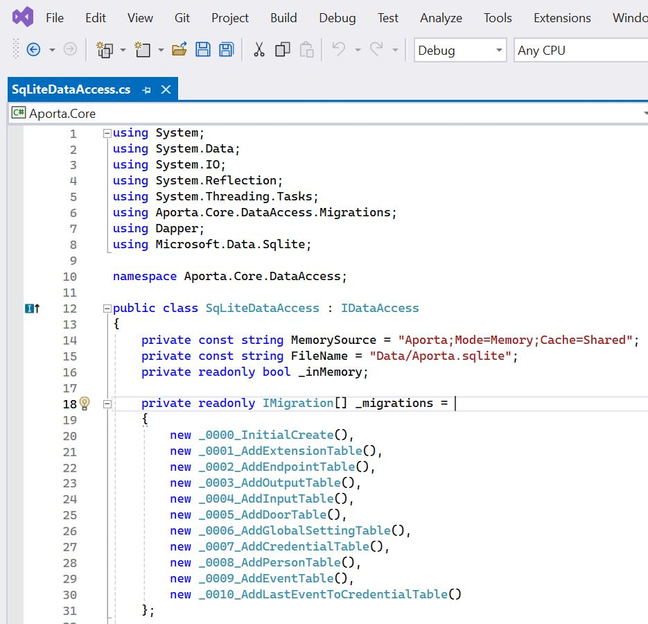
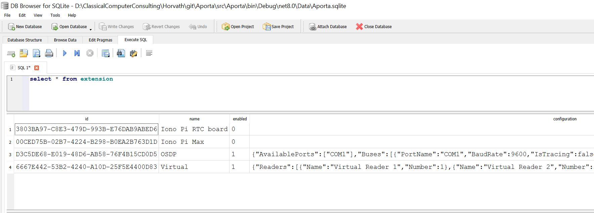
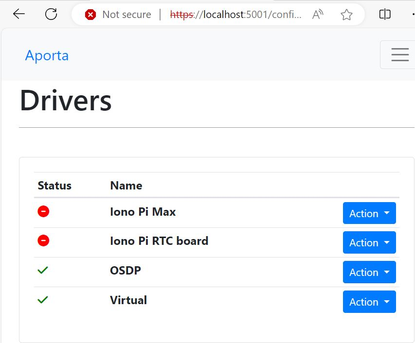

# Aporta Database

Aporta uses [SQLite](https://www.sqlite.org/) as the database and the [Microsoft.Data.SQLite](https://system.data.sqlite.org/)  package for interfacing with the database.

The database is located in the project under:

Aporta.Core\DataAccess\aporta.sqlite

Use [sqlitebrowser](https://sqlitebrowser.org/) to view the database tables.




# Database table creation

The database table create scripts are stored in the Aporta.Core/DataAccess/Migrations folder





# About the tables

In the database, **Drivers** are stored in the Extensions table.



Column Extensions.Configuration stores the configuration for each driver as JSON.

Here is the configuration for the Virtual Device Driver:

``` JSON

{
"Readers":[
	{"Name":"Virtual Reader 1","Number":1},
	{"Name":"Virtual Reader 2","Number":2},
	{"Name":"Virtual Reader 3","Number":3}],
"Outputs":[
	{"Name":"Virtual Output 1","Number":1}],
"Inputs":[
	{"Name":"Virtual Input 1","Number":1}]
}

```




# Miscellaneous SQL

``` SQL

insert into door
    (in_access_endpoint_id, out_access_endpoint_id, 
     door_contact_endpoint_id, request_to_exit_endpoint_id, 
     door_strike_endpoint_id, name) values 
    (@inAccessEndpointId, @outAccessEndpointId, @doorContactEndpointId, 
     @requestToExitEndpointId, @doorStrikeEndpointId, @name)


insert into input
    (endpoint_id, name) values 
    (@endpointId, @name)
```