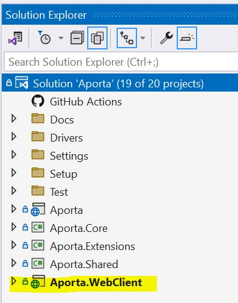

# Aporta HouseKeeping - Project Setup


## Configuration
The Aporta Configuration file is located in the **Aporta** Project. 

The configuration file is appsettings.json


```json
{
    "EventLog": {
        "LogLevel": {
            "Default": "Information", -> configure default logging level
            "Microsoft": "Warning",
            "Microsoft.Hosting.Lifetime": "Information"
            }
    },
    "AllowedHosts": "*",
    "Kestrel": {
        "EndPoints": {
            "Https": {
              "Url": "https://*:8443" -> web site port number (check machine firewall settings if connecting remotely)
            }
        }
    }
}
```

## Startup Project
Set Aporta.WebClient as the startup project. 



