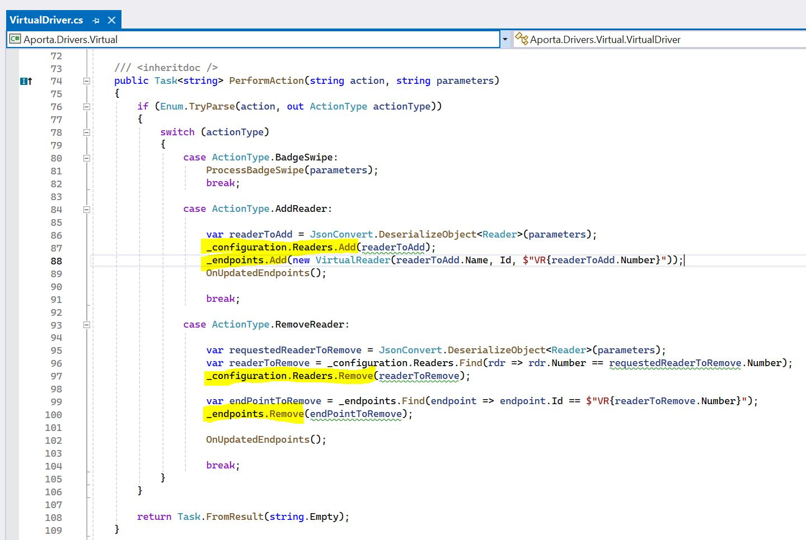

# Aporta Device Architecture

Devices in Aporta has a 3 layered architecture to them.

1. Driver
2. Configuration
3. Endpoint

Each device has a driver. Drivers query the physical security hardware that Aporta is connected to and retrieve the hardware configuration.

Each driver in turn has configuration. 

Endpoints are the bridge between Aporta and the driver.

## Code
When a new reader is added to the Virtual Device, the reader is added to the devices configuration and end point collection.

