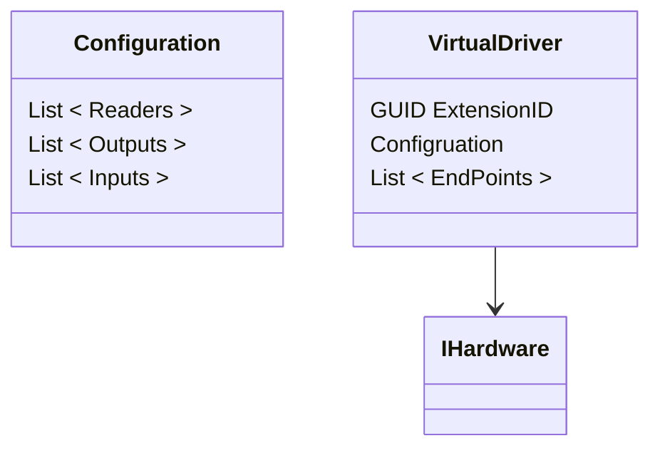
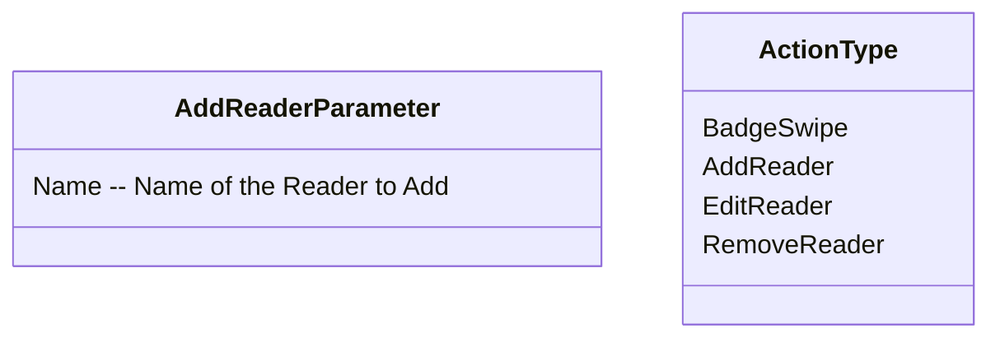

# Adding a New Reader to the Virtual Driver Configuration

## Driver Types


**ExtensionID** is a GUID that uniquely identifies a driver.

## PerformAction Types



## Flow

```mermaid

flowchart TD
    A["<b>Configuration Razor Page</b>
    Add Reader Button Click( )"]
    B["<b>DriverConfigurationCalls</b>
    PerformAction( )"]
    C["<b>ExtensionController API</b>
    PerformAction( )"
    ]
    D["<b>Extension Service</b>
    PerformAction( )
    Finds the mathing Hardware Driver Interface associated with the passed in ExtensionID
    and calls its PerformAction( )"]
    
    E["<b>Virtual Driver</b>
    PerformAction( )
    "]
    F["<b>Virtual Driver</b>
    AddReader( )
    Add the reader to the Virtual Driver EndPoints collection and Configuration 
    Readers collection
    "]
    G[ <b>Virtual Driver</b> OnUpdatedEndpoints Event Raised ]
    H[fa:fa-database <b>Extension Service</b> - OnUpdatedEndpoints Event Handler
    New Reader is Stored in Database]
    
    A-- "(ExtensionID, AddReaderParameter, ActionType = AddReader)" -->B
    B-- "(ExtensionID, AddReaderParameter, ActionType = AddReader)" -->C
    C -- "(ExtensionID, AddReaderParameter, ActionType = AddReader)" --> D
    
    D --"AddReaderParameter, ActionType = AddReader" --> E
    E --"AddReaderParameter"--> F
    F --> G
    G --> H
    
    
    
    ```
    
