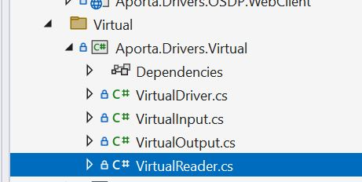
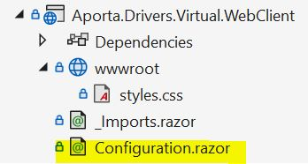

# Virtual Reader Project Goals

## 1. Add, Edit and Remove Virtual readers
User can add, edit and remove the virtual card readers. Similar format as other areas of UI.

### 1.1 Add Implementation Video

#### Code:

#### Use Case:

### 1.2 Edit Implementation Video

### 1.3 Remove Implementation Video

### How to Navigate to the Virtual Readers - Video

### Scope - add, edit and remove

**Aporta.Drivers.Virtual.VirtualReader** csharp file

**Aporta.Drivers.Virtual.WebClient.Configuration** razor file

## 2. Permission checks for deletes
Add logic to handle/prevent removing virtual reader from existing door assignment. 

## 3. Logic reused for physical hardware assigned to doors

## 4. Create UI unit tests

