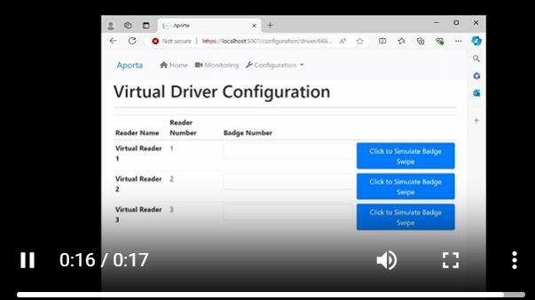

# Virtual Reader Project Goals

## 1. add, edit and remove 
User can add, edit and remove the virtual card readers. Similar format as other areas of UI.

### How to Navigate to the Virtual Readers - Video

### Scope - add, edit and remove

## 2. Logic Permissions checks for deletes
Add logic to handle/prevent removing virtual reader from existing door assignment. 

## 3. Logic reused for physical hardware assigned to doors

## 4. Create UI unit tests